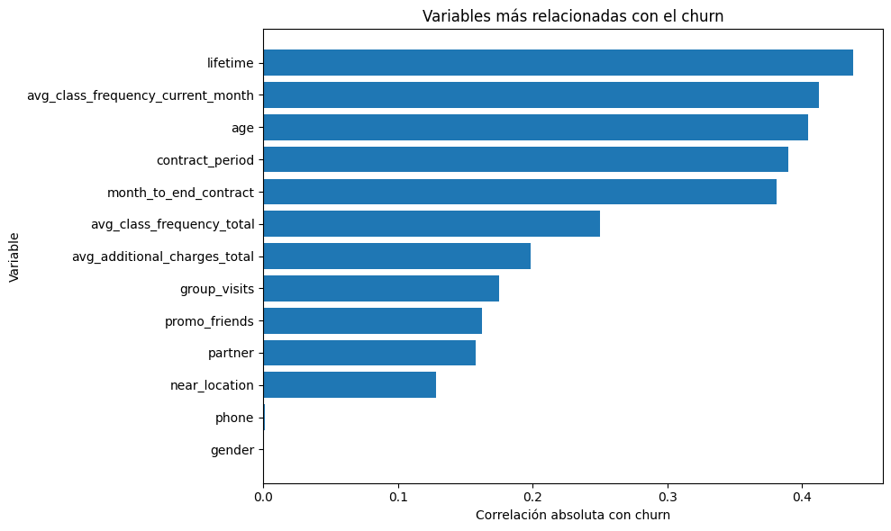
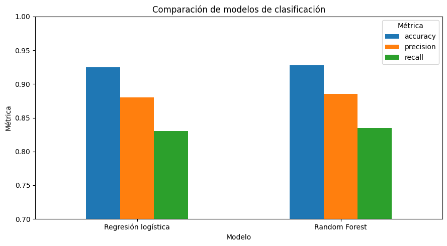
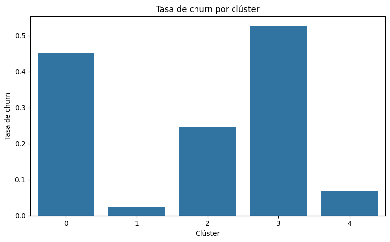

# Análisis de Retención y Churn de Clientes

Análisis de comportamiento y abandono de clientes de una cadena de gimnasios mediante análisis exploratorio, modelos de clasificación y segmentación de clientes.

El objetivo es identificar patrones asociados con el churn, detectar clientes con mayor riesgo de abandono y proponer estrategias de retención basadas en datos.

## Objetivo

El proyecto busca responder principalmente a las siguientes preguntas:

1. ¿Qué características diferencian a los clientes que permanecen de aquellos que abandonan?
2. ¿Es posible predecir qué clientes presentan mayor riesgo de churn?
3. ¿Existen segmentos de clientes con comportamientos y tasas de abandono diferentes?
4. ¿Qué acciones de retención podrían aplicarse a los grupos de mayor riesgo?

Para responderlas se utilizaron técnicas de **EDA, Machine Learning supervisado y clustering**.

---

## Resumen ejecutivo

El análisis permitió identificar patrones claros relacionados con el abandono de clientes y construir modelos capaces de anticipar el churn con un nivel elevado de precisión.

### Principales resultados

- Los clientes con **contratos más cortos, menor antigüedad y menor frecuencia de asistencia** muestran una mayor tendencia al abandono.
- La frecuencia de uso del gimnasio aparece como una de las señales relevantes relacionadas con la retención.
- La **Regresión Logística** alcanzó:
  - Accuracy: **92.5%**
  - Precision: **88.0%**
  - Recall: **83.0%**
- **Random Forest** obtuvo ligeramente mejores resultados:
  - Accuracy: **92.7%**
  - Precision: **88.5%**
  - Recall: **83.5%**
- La segmentación mediante K-Means permitió identificar **cinco perfiles de clientes** con tasas de churn muy diferentes.
- Los clústeres 3 y 0 presentan el mayor riesgo, con tasas de churn aproximadas del **53% y 45%**.
- Los clústeres 1 y 4 presentan los niveles de abandono más bajos, con aproximadamente **2% y 7%** respectivamente.

## Decisión de negocio

La estrategia de retención debería combinar:

1. **Predicción individual de churn**, para identificar anticipadamente clientes con riesgo de abandono.
2. **Segmentación de clientes**, para adaptar las acciones de retención al comportamiento de cada perfil.

Los esfuerzos deberían priorizar especialmente a clientes con **baja frecuencia de asistencia, contratos cortos y poca antigüedad**.

➡️ [Ver análisis completo en el notebook](notebook/analisis_retencion_clientes.ipynb)

---

## Datos

El análisis utiliza el dataset:

- `gym_churn_us.csv`

El archivo contiene información sobre características y comportamiento de los clientes, incluyendo:

- proximidad al gimnasio;
- duración del contrato;
- participación en actividades grupales;
- edad;
- cargos adicionales;
- antigüedad;
- frecuencia de asistencia;
- meses restantes de contrato;
- variable objetivo `churn`.

El dataset contiene **4,000 clientes y 14 variables**.

Los datos fueron proporcionados originalmente como parte de un ejercicio de formación del programa de **Data Analyst de TripleTen**.

El dataset original no se redistribuye públicamente en este repositorio.

Más información en [`data/README.md`](data/README.md).

---

## Metodología

El proyecto se desarrolló en las siguientes etapas:

1. Revisión de estructura y calidad de los datos.
2. Estandarización de nombres de variables.
3. Análisis descriptivo general.
4. Comparación de clientes según churn.
5. Análisis de distribuciones.
6. Estudio de correlaciones.
7. División de los datos en entrenamiento y prueba.
8. Estandarización de variables.
9. Entrenamiento de una **Regresión Logística**.
10. Entrenamiento de un modelo **Random Forest**.
11. Evaluación mediante accuracy, precision y recall.
12. Comparación de los modelos.
13. Estandarización de variables para clustering.
14. Análisis jerárquico mediante dendrograma.
15. Segmentación mediante **K-Means**.
16. Análisis del perfil y churn de cada clúster.
17. Formulación de estrategias de retención.

---

## Herramientas

- **Python**
- **pandas**
- **NumPy**
- **Matplotlib**
- **Seaborn**
- **SciPy**
- **scikit-learn**
- **Google Colab**
- **Jupyter Notebook**
- **GitHub**

---

## Visualizaciones clave

### 1. Variables relacionadas con el churn

El análisis de correlaciones permite identificar qué características presentan una mayor relación con el abandono de clientes.



---

### 2. Comparación de modelos predictivos

Ambos modelos presentan un desempeño elevado.

Random Forest obtiene una ligera ventaja frente a la regresión logística en accuracy, precision y recall.



---

### 3. Tasa de churn por segmento

La segmentación permite observar diferencias importantes entre los perfiles de clientes.

Los clústeres 3 y 0 concentran los niveles de riesgo más elevados.



---

## Comparación de modelos

| Modelo | Accuracy | Precision | Recall |
|---|---:|---:|---:|
| Regresión Logística | 92.5% | 88.0% | 83.0% |
| Random Forest | **92.7%** | **88.5%** | **83.5%** |

Random Forest obtiene los mejores resultados en las tres métricas, aunque la diferencia respecto a la regresión logística es reducida.

En un contexto de retención, el **recall** resulta especialmente importante porque representa la capacidad del modelo para detectar clientes que realmente terminarán abandonando.

---

## Segmentación de clientes

K-Means permitió identificar cinco grupos con comportamientos diferentes:

| Clúster | Clientes | Churn aprox. | Perfil |
|---|---:|---:|---|
| 0 | 544 | 45% | Riesgo alto |
| 1 | 936 | 2% | Muy alta retención |
| 2 | 646 | 25% | Riesgo medio |
| 3 | 1,107 | 53% | Riesgo muy alto |
| 4 | 767 | 7% | Alta retención |

### Clúster 3 — Riesgo muy alto

Presenta la mayor tasa de churn. Sus clientes muestran principalmente contratos cortos, menor antigüedad y baja frecuencia de asistencia.

### Clúster 0 — Riesgo alto

También presenta un nivel elevado de abandono y destaca por una mayor presencia de clientes que no viven cerca del gimnasio.

### Clúster 2 — Riesgo medio

Representa un segmento intermedio sobre el que podrían aplicarse acciones preventivas antes de que aparezcan señales más fuertes de abandono.

### Clústeres 1 y 4 — Alta retención

Presentan las tasas de churn más bajas y se caracterizan por una mayor vinculación con el gimnasio, especialmente mediante contratos más largos, mayor antigüedad o una frecuencia de asistencia superior.

---

## Insights clave

- El churn no depende de una única variable, sino de una combinación de comportamiento, antigüedad y características contractuales.
- Los **contratos cortos** están asociados con un mayor riesgo de abandono.
- Una **baja frecuencia de asistencia** puede funcionar como señal temprana de riesgo.
- Los clientes con mayor antigüedad muestran una mayor estabilidad.
- Random Forest presenta una ligera ventaja predictiva frente a la regresión logística.
- La segmentación permite diferenciar grupos con tasas de churn desde aproximadamente **2% hasta 53%**.
- No todos los clientes deberían recibir la misma estrategia de retención.

---

## Recomendaciones de negocio

### Clientes de alto riesgo

Para los segmentos con mayor probabilidad de abandono:

- activar campañas cuando disminuya la frecuencia de visitas;
- realizar seguimiento durante los primeros meses;
- incentivar contratos de mayor duración;
- recomendar clases o actividades personalizadas;
- ofrecer incentivos antes de la renovación.

### Clientes de riesgo medio

- monitorizar cambios en frecuencia de asistencia;
- fomentar la participación en actividades grupales;
- utilizar comunicaciones preventivas antes de que aparezcan señales más fuertes de churn.

### Clientes con alta retención

- fortalecer programas de fidelización;
- impulsar programas de recomendación y referidos;
- estudiar qué elementos de su experiencia pueden replicarse en segmentos de mayor riesgo.

---

## Recomendación final

La empresa puede utilizar un enfoque combinado de **Machine Learning y segmentación** para pasar de una estrategia reactiva a una estrategia preventiva de retención.

Random Forest podría utilizarse como herramienta para identificar clientes con mayor riesgo individual, mientras que los clústeres permitirían definir tratamientos diferentes según el perfil del cliente.

El principal foco debería situarse en detectar de forma temprana la reducción de actividad y actuar especialmente sobre clientes con **contratos cortos, baja frecuencia de asistencia y poca antigüedad**.

---

## Estructura del repositorio

```text
analisis-retencion-clientes/
│
├── data/
│   └── README.md
│
├── images/
│   ├── variables_relacionadas_churn.png
│   ├── comparacion_modelos.png
│   └── churn_por_cluster.png
│
├── notebook/
│   └── analisis_retencion_clientes.ipynb
│
├── .gitignore
├── LICENSE
├── README.md
└── requirements.txt
```

---

## Cómo reproducir el análisis

### Google Colab

1. Descargar o clonar este repositorio.
2. Abrir `notebook/analisis_retencion_clientes.ipynb` en Google Colab.
3. Disponer del archivo:
   - `gym_churn_us.csv`
4. Subir el dataset al entorno de ejecución.
5. Ejecutar las celdas del notebook en orden.

El notebook espera actualmente el dataset en:

```text
/content/gym_churn_us.csv
```

### Dependencias

Las librerías necesarias se encuentran en `requirements.txt`.

También pueden instalarse mediante:

```bash
pip install -r requirements.txt
```

---

## Nota sobre los datos

El dataset original fue proporcionado con fines educativos dentro del programa de Data Analyst de TripleTen.

Por este motivo, el archivo CSV original **no se redistribuye públicamente** en este repositorio.

El código, las visualizaciones, la metodología y las conclusiones desarrolladas para este proyecto sí están disponibles.

---

## Autor

Proyecto desarrollado como parte de un portafolio profesional de **Data Analytics**, con enfoque en Customer Analytics, Machine Learning, segmentación y toma de decisiones basada en datos.
